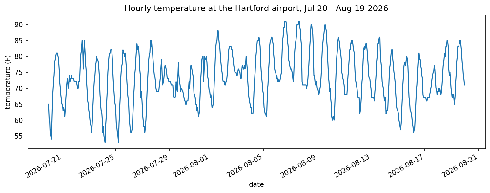
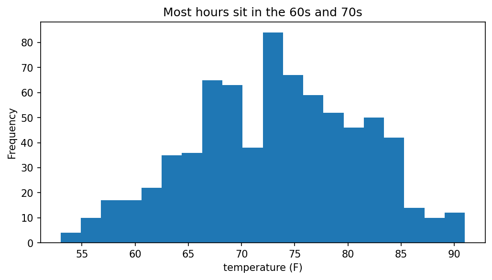
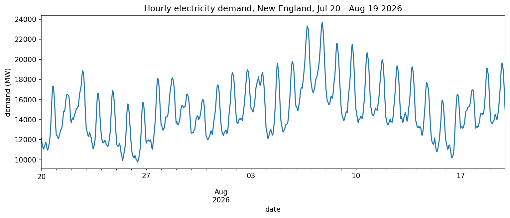
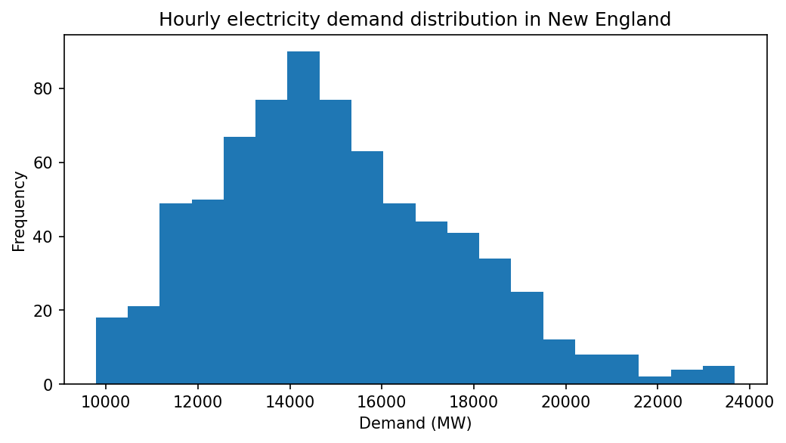

# Weather and our load — Lab 1 report

*Two people, two halves, one repo. Replace every ➜ line with a real sentence. Every number gets a unit.*

## 1. Temperature over the month

➜ One sentence: when was it hottest, and roughly how hot?

## 2. How often was it hot?

➜ One sentence: where do most hours sit, and how many hours were above 85 °F?

## 3. Demand over the month

➜ One sentence: when did demand peak, and at roughly how many MW?

## 4. How often was the grid working hard?

➜ One sentence: where do most hours sit, and how many hours were above 20,000 MW?

## 5. (Optional) Demand vs temperature

➜ One sentence a manager understands: *"each degree above ___ °F adds roughly ___ MW."*

## What this data can't tell us
➜ One honest sentence. (One summer month. One airport. Region-wide demand.)
